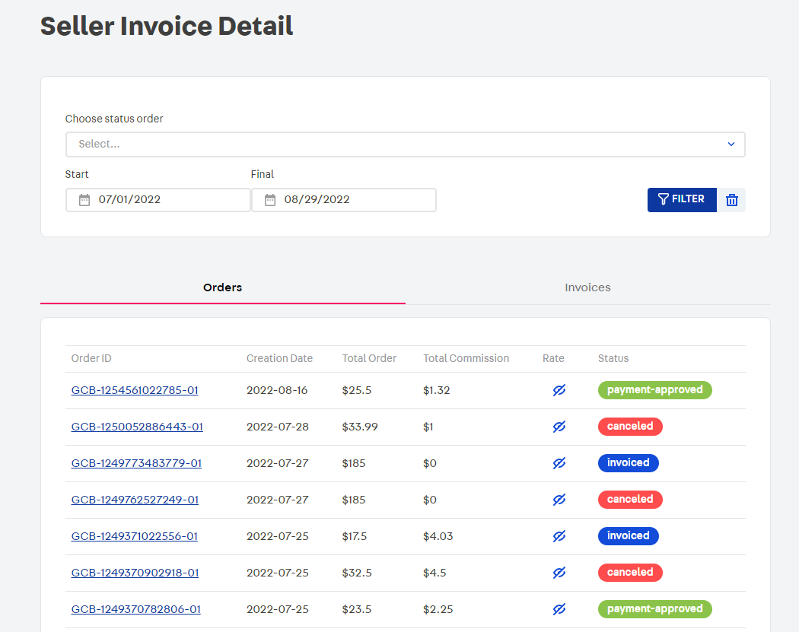
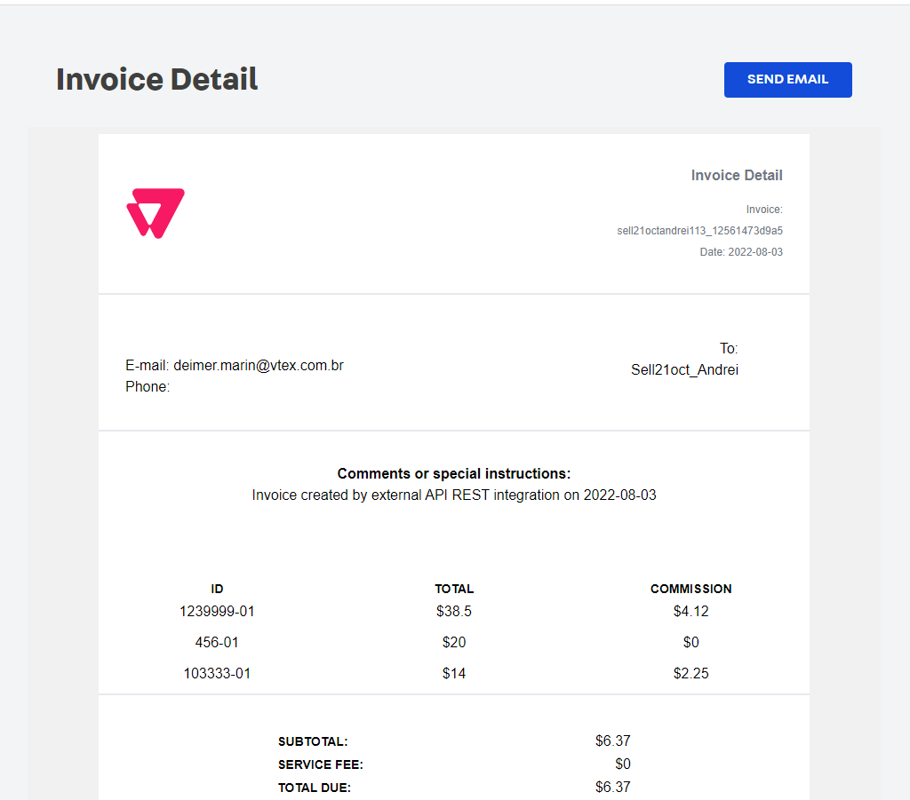
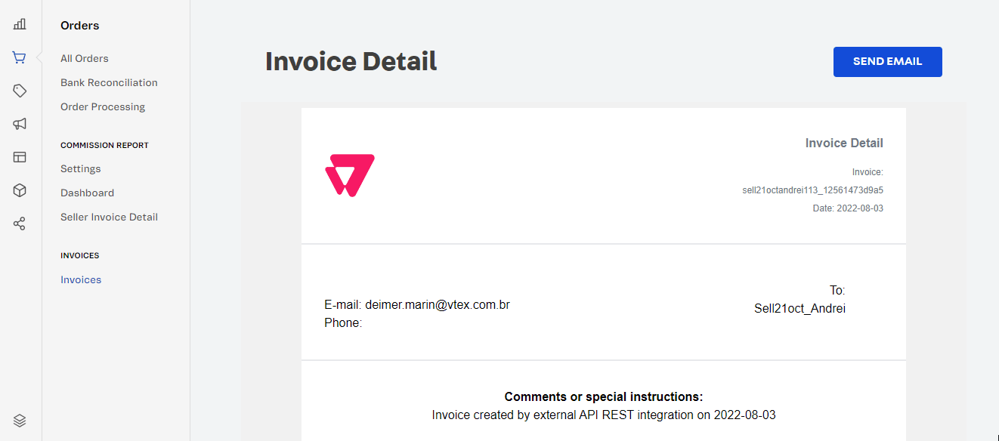

📢 Use this project, [contribute](https://github.com/{OrganizationName}/{AppName}) to it or open issues to help evolve it using [Store Discussion](https://github.com/vtex-apps/store-discussion).

# Seller financial commission

**Seller Financial commission** provides a way to list all orders and invoices created by a specific seller, filter them by status or by a specific period of time.


## **Install:**

Install `vtex.seller-financial-commission` in your account.

```powershell
vtex install vtex.seller-financial-commission
```

## **Features:**

- List All Seller Orders and Invoices at the end of the billing cycle. <br/>
  - Each order is listed with its respective ID, Creation Date, Total Ammount, Total Commission, Rate and Status.
  - Each invoice is listed with its respective status and with its creation date.
- Orders and Invoices can be filtered by Status or by creation date
- Visualize invoice detail.
  
- A copy of the invoice detail can be sent by e-mail. By default the e-mail will be sent to the vendor's address, but this value can be changed
  

## **Components financial commission:**

This app allows you create the interface to show the information about the commissions of the sellers.

Add the components financial app in your new apps in the section dependencies of the manifest file.

```powershell
"dependencies":{
  "vtex.components-financial-commission": "0.x"
}
```

`⚠️` See more details about this app related with the technical topics [Components financial](https://github.com/vtex-apps/components-financial-commission/)

### Important:

`🚫` Please, don't upload the file `yarn.lock`. Remove this file of the `commit`.

`✅` When you clone the project, create your work branch from `develop`.

`✅` Upload your changes by making a `pull request`.

`⚠️` Not forget to update the version and documentation. This last only if this is necessary.
